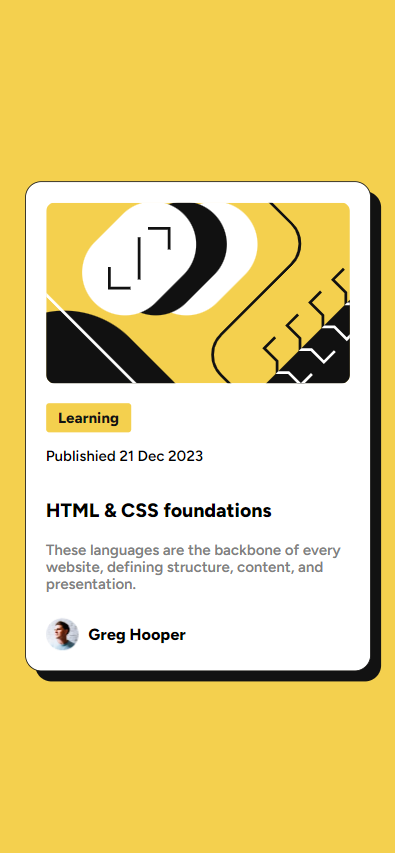

# Frontend Mentor - Blog preview card solution

This is a solution to the [Blog preview card challenge on Frontend Mentor](https://www.frontendmentor.io/challenges/blog-preview-card-ckPaj01IcS). Frontend Mentor challenges help you improve your coding skills by building realistic projects. 

## Table of contents

- [Overview](#overview)
  - [The challenge](#the-challenge)
  - [Screenshot](#screenshot)
  - [Links](#links)
- [My process](#my-process)
  - [Built with](#built-with)
  - [What I learned](#what-i-learned)
  - [Continued development](#continued-development)
  - [Useful resources](#useful-resources)
- [Author](#author)

## Overview

### The challenge

Users should be able to:

- See hover and focus states for all interactive elements on the page

### Screenshot

#### Desktop Design

#### Mobile Design

#### Active state

### Links

- Solution URL: [Add solution URL here](https://your-solution-url.com)
- Live Site URL: [Add live site URL here](https://your-live-site-url.com)

## My process

First, I started thinking and building the HTML layout so that it would be easier later when I'm styling with CSS. 
Then, I used a [normalize.css](/normalize.css) to avoid errors that could appear at any time from one of the common browsers. 
And finally, I began styling the HTML layout creating the proper variables and implementing Mobile-first workflow, allowing me improve my design skills with this approach.

### Built with

- Semantic HTML5 markup
- CSS custom properties
- Flexbox
- Mobile-first workflow

### What I learned

I learned how variable and static fonts are differents and how it's works. In simple words, variable fonts are:
- An alternative that allows you to modify one (or more) axes of variation with one single file.
- A way to improve the website accessibility.

### Continued development

In my future projects I'll try to improve responsive web design by learning and practicing more CSS!

### Useful resources

- [Difference between static and variable fonts](https://www.browserstack.com/guide/variable-fonts-vs-static-fonts#:~:text=Static%20Fonts%20do%20not%20support,Fonts%20offer%20multiple%20typographic%20variations.) - This helped me understand the behavior of variable and static fonts.

## Author

- Website - [Gonzalo Piccinini](https://gonzalopiccinini.vercel.app)
- Linkedin - [Gonzalo Piccinini](https://www.linkedin.com/in/gonzalo-piccinini-9a7378227/)
- Frontend Mentor - [@GonzaPiccinini](https://www.frontendmentor.io/profile/GonzaPiccinini)
- Twitter - [@gonzapiccinini_](https://www.twitter.com/gonzapiccinini_)
